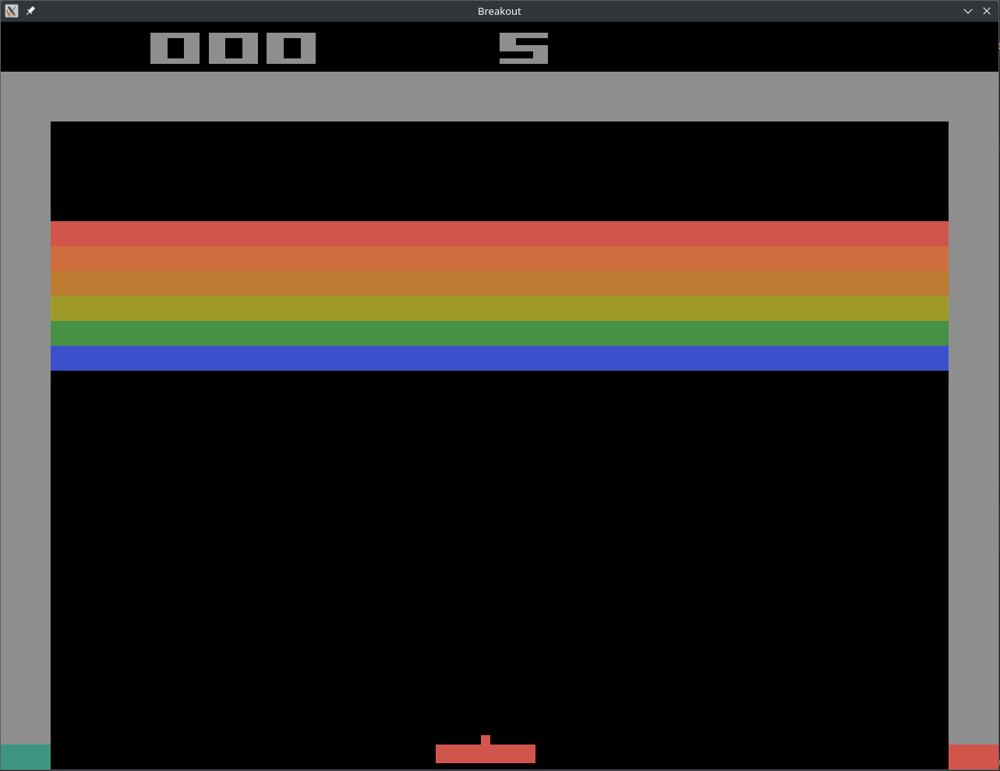
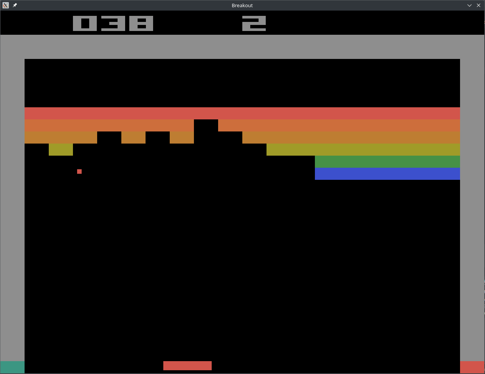
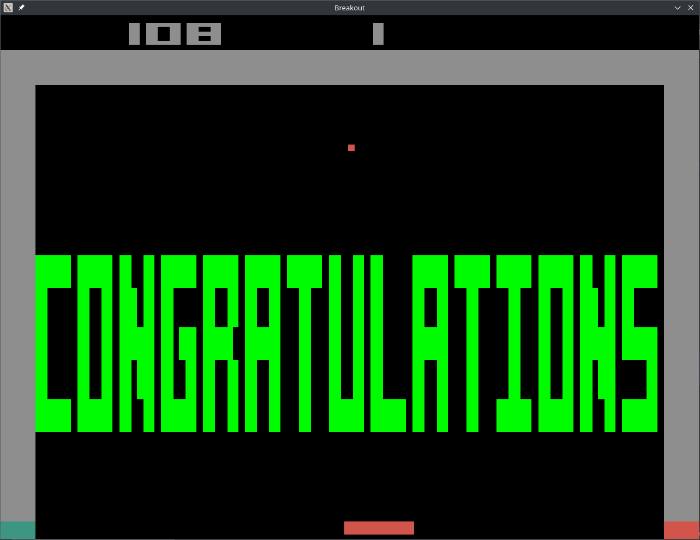

# C Breakout

Breakout (based on the original game by Atari) implemented in C using the SDL2 library.\
This project was created as part of the VSB-TUO course "Introduction to Programming" (2021-12-15).\
The game is controlled using mouse input.\
You can create your own levels and load them into the game.

## Requirements
- C compiler (C11)
- [SDL2](https://github.com/libsdl-org/SDL)
- [SDL2_ttf](https://github.com/libsdl-org/SDL_ttf)
- [SDL2_mixer](https://github.com/libsdl-org/SDL_mixer)
- Cmake

## Installation
1. Clone the repository
2. Build using `cmake . && make -j`
3. Run the game using `./breakout`

```bash
# Clone
git clone https://github.com/Petrkowal/Breakout.git
cd Breakout

# Build
mkdir build && cd build
cmake .. && make -j

# Run
./breakout
```

## Custom levels

You can create your own levels and load them using the `-f (--file)` parameter. The default level is `data/lvl/breakout.lvl`.\
The file needs to end with `.lvl`. If the extension is missing in the parameter, it will be appended.

```bash
./breakout -f path/to/your/level.lvl
```

### Level file format

On the first line, you need to specify the number of lives for the level.\
The rest of the file is composed of bricks in the following format:\
`
int int int char;
`
- The first two integers specify the x and y position (index) of the brick.
    - x must be in the range [0, 17]
    - y must be in the range [0, 10]
- The third integer specifies the number of lives of the brick.
- The character specifies the color of the brick.
  - r - Red
  - g - Green
  - b - Blue
  - o - Orange
  - w - broWn
  - y - Yellow
- Each brick must end with a semicolon `;`
- There can be any whitespaces between the bricks (e.g. newlines)

### Example level file
```
5
0 0 1 r; 1 0 2 r; 2 0 1 r;
0 1 2 g; 1 1 3 g; 2 1 2 g;
0 2 1 b; 1 2 2 b; 2 2 1 b;
```
- The first line specifies that the player has 5 lives.
- The rest of the file specifies the bricks in the first three rows (the newlines are optional).
- The first row consists of three red bricks with 1, 2, and 1 life.
- The second row consists of three green bricks with 2, 3, and 2 lives.
- The third row consists of three blue bricks with 1, 2, and 1 life.

## Controls

- The game is controlled using the mouse.
- The ball is released by a mouse click.
- The ball is released at a random angle in the range of 60° perpendicularly to the paddle.
- The ball bounces off the paddle at an angle of 0 - 60° depending on the distance of the ball from the center of the paddle.
- When the game ends, you can restart it by clicking.

## Screenshots
<p>


</p>
